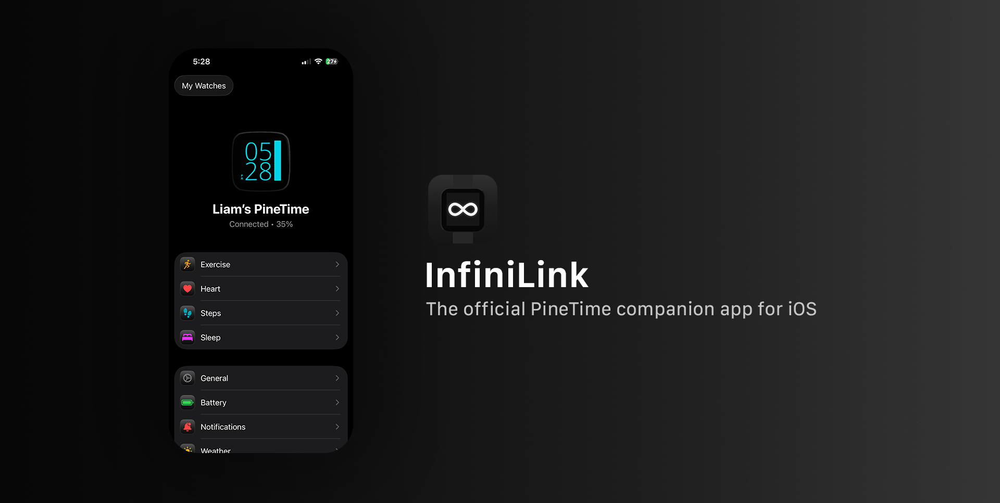

 

> [!WARNING]
> This branch is still in development and may not have all features implemented and/or unexpected bugs!

### Features:
- Discover and connect to nearby InfiniTime devices
- Set time and date immediately after connection
- Battery, heart rate, and step charts
- Control Apple Music with InfiniTime's music controls
- Integration with Apple HealthKit
- Weather fetch (using WeatherKit) and push (using InfiniTime 1.14's [Simple Weather Service](https://github.com/InfiniTimeOrg/InfiniTime/blob/main/doc/SimpleWeatherService.md))
- Uploading of [external resource packages](https://github.com/InfiniTimeOrg/InfiniTime/blob/develop/doc/gettingStarted/updating-software.md#updating-resources)
- Download and install InfiniTime firmware updates from GitHub releases and local files

### Partially implemented features:
- Apple Charts with date range selection
- System-wide notifications—implemented in [#2217](https://github.com/InfiniTimeOrg/InfiniTime/pull/2217), but not available in the main branch yet.

### Currently non-functional features:
- System-wide music controls—requires implementation of Apple Media Service.

### Planned features:
- InfiniTime navigation service using MapKit
- Battery, heart, and step widgets

## Installation
- **Version 1.0.2** is available on the [App Store](https://apps.apple.com/us/app/infinilink/id1582318814).
- **Version 1.2** is available on [TestFlight](https://testflight.apple.com/join/B3PY5HUV).

## License
Released under [GPL-3.0](/LICENSE) by [@InfiniTimeOrg](https://github.com/InfiniTimeOrg).
