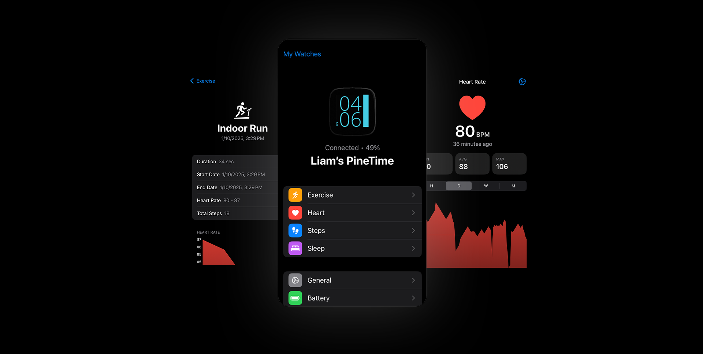

 
  

# InfiniLink
*The official iOS companion app for [InfiniTime](https://github.com/InfiniTimeOrg/InfiniTime).*

 

> [!NOTE]
> This is branch is under heavy development and may be unstable. Please refer to the `main` branch for the most stable version of the app.

### Features:
- Discover and connect to nearby InfiniTime devices
- Set time and date immediately after connection
- Retrieve battery level, heart rate, and step data
- Chart persistence, with filters for the last hour, day, and week
- Control Apple Music with InfiniTime's music controls
- Integration with Apple HealthKit
- Weather fetch (using WeatherKit) and push (using InfiniTime 1.14's [Simple Weather Service](https://github.com/InfiniTimeOrg/InfiniTime/blob/main/doc/SimpleWeatherService.md))
- Uploading of [external resource packages](https://github.com/InfiniTimeOrg/InfiniTime/blob/develop/doc/gettingStarted/updating-software.md#updating-resources)
- Download and install InfiniTime firmware updates from releases and GitHub Actions using the GitHub API (local file updates are supported)

### Partially implemented features:
- System-wide notifications—implemented in [#2217](https://github.com/InfiniTimeOrg/InfiniTime/pull/2217), but not available in the main branch yet.

### Currently non-functional features:
- System-wide music controls—requires implementation of Apple Media Service.

### Planned features:
- InfiniTime navigation service using MapKit

## Installation:
- **Version 1.0.2** is available on the [App Store](https://apps.apple.com/us/app/infinilink/id1582318814).
- **Version 1.1** is available on [TestFlight](https://testflight.apple.com/join/B3PY5HUV).
- **Version 1.2** is available on [TestFlight](https://testflight.apple.com/join/VX7E73Wt).

> [!CAUTION]
> Version *1.2* of InfiniLink has been built from the ground up and is still in early development stages, and as such, may not work as expected.

## License
Released under [GPL-3.0](/LICENSE) by [@InfiniTimeOrg](https://github.com/InfiniTimeOrg).
